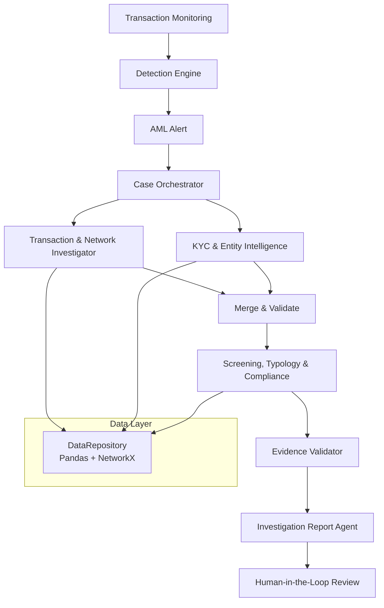
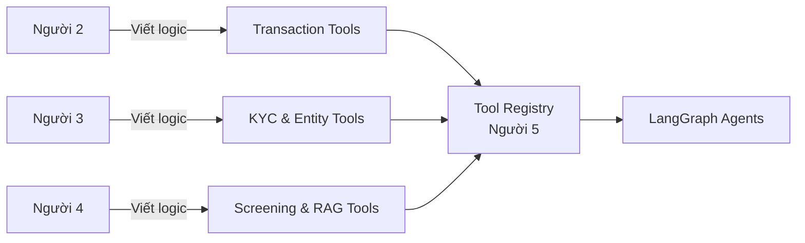

# AML Investigator - Architecture
**Mục tiêu:** Xây dựng hệ thống Multi-Agent hỗ trợ điều tra AML cho ngân hàng SHB, sử dụng synthetic data SHB-centric.

---

## 1. Tổng quan (Overview)

**FinCrime Investigator** là hệ thống AI hỗ trợ chuyên viên AML điều tra các cảnh báo giao dịch đáng ngờ. Hệ thống không tự động ra quyết định compliance, mà tập trung vào việc **thu thập bằng chứng, phân tích mạng lưới, và trình bày hồ sơ điều tra có cấu trúc** để chuyên viên ra quyết định nhanh và chính xác hơn.

### Nguyên tắc cốt lõi
- **Evidence-first**: Mọi finding phải có evidence và nguồn rõ ràng.
- **Human-in-the-Loop**: Quyết định cuối cùng luôn thuộc về chuyên viên AML.
- **SHB-centric visibility**: Hệ thống chỉ sử dụng dữ liệu SHB có thể quan sát được. Không suy diễn dữ liệu của ngân hàng khác.
- **Explainability**: Mọi kết luận đều có thể truy vết nguồn và mức độ tin cậy.

---

## 2. Kiến trúc tổng thể (High-level Architecture)

### Các thành phần chính

| Thành phần | Owner | Mô tả | Loại |
|-----------|-------|-------|------|
| **Detection Engine** | Người 1 | Phát hiện alert từ giao dịch | Rule + ML (không LLM) |
| **Case Orchestrator** | Người 5 | Quản lý vòng đời case, điều phối agent | LangGraph |
| **Transaction & Network Investigator** | Người 2 | Truy vết dòng tiền, phát hiện pattern | Tools + Agent |
| **KYC & Entity Intelligence** | Người 3 | Phân tích KYC, ownership, UBO | Tools + Agent |
| **Screening, Typology & Compliance** | Người 4 | Screening, typology matching, RAG | Tools + Agent |
| **Investigation Report Agent** | Người 5 | Tổng hợp hồ sơ điều tra | Agent |
| **Human AML Reviewer** | Con người | Phê duyệt / yêu cầu bổ sung | HITL |

---

## 3. Mô hình dữ liệu (Data Model) - SHB-centric

Hệ thống tuân thủ mô hình **Single Home Bank + External Counterparties**.

### 3.1. Nguyên tắc dữ liệu

- Chỉ **customers**, **companies**, và **accounts** của SHB mới có đầy đủ KYC, UBO, device, IP, lịch sử giao dịch.
- Các ngân hàng khác chỉ xuất hiện dưới dạng **external counterparties** thông qua payment message.
- Không tạo full ledger hay KYC cho external entities.

### 3.2. Các bảng chính

| Bảng | Nội dung | Ghi chú |
|------|----------|--------|
| `customers.csv` | Khách hàng cá nhân của SHB | Có KYC đầy đủ |
| `companies.csv` | Doanh nghiệp có tài khoản tại SHB | Có KYC + UBO |
| `accounts.csv` | Tài khoản nội bộ SHB | `bank_id = BANK-SHB-001` |
| `external_accounts.csv` | Đối tác bên ngoài (mới) | Chỉ metadata từ payment message |
| `transactions.csv` | Giao dịch qua SHB | Có `source_account_type`, `direction`, `data_visibility` |
| `banks.csv` | Danh mục ngân hàng | Có cột `is_home_bank` |
| `kyc_profiles.jsonl` | Hồ sơ KYC | Chỉ cho thực thể SHB |
| `company_ownership.csv` | Quan hệ sở hữu | Chỉ cho công ty SHB |
| `watchlist_entries.jsonl` | Danh sách theo dõi | Dùng để screening |

### 3.3. Quy tắc về Visibility

| Loại giao dịch | data_visibility | evidence_source | Ghi chú |
|----------------|------------------|------------------|--------|
| SHB → SHB | `FULL_INTERNAL` | `SHB_TRANSACTION_LEDGER` | Dữ liệu đầy đủ |
| External → SHB | `PAYMENT_MESSAGE_ONLY` | `PAYMENT_MESSAGE` | Chỉ có thông tin từ điện chuyển |
| SHB → External | `PAYMENT_MESSAGE_ONLY` | `PAYMENT_MESSAGE` | Chỉ có thông tin outbound |
| Có enrichment | `ENRICHED_EXTERNAL` | `INTERBANK_ENRICHMENT_DEMO` | Phải ghi rõ nguồn enrichment |

---

## 4. Kiến trúc Agent & Tool (LangGraph)

### 4.1. Mô hình Tool Ownership

### 4.2. Danh sách Tool chính (được expose cho LLM)

**Transaction & Network Tools (Người 2):**
- `get_account_transactions`
- `trace_funds`
- `detect_rapid_pass_through`
- `detect_fan_in_fan_out`
- `find_common_funding_sources`
- `find_shared_identifiers`
- `build_case_subgraph`

**KYC & Entity Tools (Người 3):**
- `get_company_profile`
- `get_kyc_documents`
- `build_ownership_graph`
- `calculate_ubo`
- `compare_profile_with_behavior`
- `find_ownership_gaps`

**Screening & Compliance Tools (Người 4):**
- `screen_internal_watchlist`
- `evaluate_typology_match`
- `retrieve_internal_policy`
- `validate_citations`

### 4.3. Workflow Orchestration (Người 5)

Người 5 chịu trách nhiệm:
- Xây dựng `Shared Case File` state
- Đăng ký tool vào LangGraph
- Xây dựng graph với parallel execution + conditional routing
- Xử lý `interrupt` cho Human Review
- Validate output của agent trước khi merge

---

## 5. Quy trình xử lý Case (End-to-End Workflow)

1. **Detection** → Tạo Alert
2. **Orchestrator** → Tạo Case + Investigation Plan
3. **Song song**:
   - Transaction & Network Agent
   - KYC & Entity Agent
4. **Merge & Validate**
5. **Screening + Typology Agent**
6. **Evidence Validation** (Deterministic)
7. **Report Agent** → Draft dossier
8. **Human Review** → Quyết định cuối cùng

---

## 6. Nguyên tắc thiết kế then chốt

| Nguyên tắc | Mô tả | Lý do |
|----------|-------|-------|
| **SHB-centric** | Chỉ dùng dữ liệu SHB quan sát được | Phù hợp thực tế ngân hàng |
| **Evidence Quality** | Phân biệt rõ mức độ tin cậy của dữ liệu | Agent phải học cách xử lý uncertainty |
| **Tool Ownership** | Người 2,3,4 sở hữu logic, Người 5 sở hữu orchestration | Tách biệt rõ trách nhiệm |
| **Deterministic Validation** | Evidence Validator chạy code Python, không dùng LLM | Tránh hallucination |
| **Minimal Agent Authority** | Chỉ expose những tool cần thiết cho LLM | Giảm rủi ro và dễ kiểm soát |