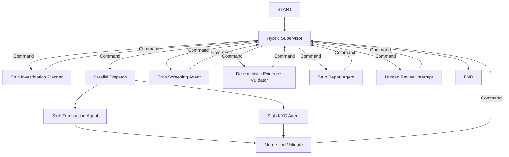

# Hybrid Supervisor Workflow Design

## 1. Scope

Implement a runnable LangGraph workflow skeleton in
`backend/app/investigation_orchestrator`. The workflow uses stub agent nodes so
that routing, parallel execution, evidence validation, and human review can be
tested before real agent tools are implemented.

The implementation does not include LLM prompts, model configuration, backend
tools, RAG, transaction algorithms, or KYC algorithms.

## 2. Architecture

The workflow combines two control patterns:

- A Hybrid Supervisor uses deterministic Python rules for mandatory routing and
  accepts a structured investigation plan that can later be produced by an LLM.
- A fixed fork/join branch runs Transaction Investigation and KYC Investigation
  in parallel before results are merged.

Dynamic stage transitions use LangGraph `Command`. The parallel fork/join uses
static graph edges because both branches are mandatory and must complete before
the merge node runs.

## 3. State Model

`InvestigationState` is a small serializable `TypedDict` containing:

- Case identity and the input AML alert.
- Current workflow phase and structured investigation plan.
- `agent_outputs`, a staging area for worker results.
- `case_file`, the canonical Shared Case File written only by Orchestrator-owned
  deterministic nodes.
- Evidence validation result and draft report.
- Human review decision.
- Append-only handoff and error logs.

Parallel worker updates to `agent_outputs` use a dictionary merge reducer.
Append-only logs use list reducers. No DataFrame, NetworkX graph, model client,
or other non-serializable object is stored in graph state.

## 4. Node Responsibilities

### Hybrid Supervisor

The Supervisor is a deterministic controller in this phase. It inspects state
and returns a `Command` to exactly one next stage. Mandatory stages cannot be
skipped. The planner output is advisory; Python preconditions control routing.

Routing order:

1. Create an investigation plan.
2. Run Transaction and KYC investigation in parallel.
3. Merge and validate both outputs.
4. Run Screening and Compliance.
5. Run deterministic evidence validation.
6. Draft a report from validated case data.
7. Interrupt for human review.
8. Finish only after a human decision.

### Stub Investigation Planner

Returns a structured list of required investigation stages. It is the future
replacement point for an LLM planner.

### Stub Worker Agents

Transaction, KYC, and Screening nodes return representative structured outputs
that comply with SHB visibility and evidence rules. They do not call real tools
and do not write directly to the canonical Shared Case File.

### Merge and Validate

Waits for both parallel branches, checks that both outputs exist, then commits
their findings and evidence into the Shared Case File. This node belongs to the
Orchestrator boundary.

### Evidence Validator

Runs deterministic Python checks:

- Every finding contains at least one `evidence_id`.
- Every referenced evidence record exists.
- Evidence contains `source_system` and `source_record_id`.
- Pattern findings include `visibility_level`.
- Screening failures remain `INCONCLUSIVE`, never `NO_MATCH`.

Only validated findings are eligible for the report. Validation issues remain
visible to the reviewer.

### Report Agent

Builds a deterministic stub dossier from validated case data. It is the future
replacement point for the LLM report agent.

### Human Review

Uses LangGraph `interrupt()` to pause execution. Resume input accepts one of:

- `APPROVED`
- `REJECTED`
- `MORE_INFORMATION_REQUIRED`

Approval and rejection end the case. A request for more information records the
requested target and returns control to the Supervisor, which ends the current
execution with case status `AWAITING_INFORMATION`. Re-entering the workflow and
targeting a real worker is deferred until real worker tools exist; the stub
workflow must not create an automatic rework loop.

## 5. Error Handling and Safety

- Missing parallel outputs produce a validation error instead of a partial
  canonical merge.
- Invalid evidence is excluded from report findings and recorded as an issue.
- Unexpected review payloads raise a clear validation error.
- A stable `thread_id` is required by callers for interrupt/resume behavior.
- The MVP graph uses `InMemorySaver`; production must inject a persistent
  checkpointer such as PostgreSQL before deployment.
- No agent can trigger account blocking, SAR/STR submission, or a final
  compliance decision.

## 6. File Layout

- `state.py`: state types, enums/literals, and reducers.
- `nodes.py`: Supervisor, planner, parallel workers, and merge node.
- `evidence_validator.py`: deterministic evidence validation node.
- `report_agent.py`: deterministic stub report node.
- `human_review.py`: interrupt/resume node and review validation.
- `workflow.py`: graph construction and compilation.
- `__init__.py`: stable public exports.
- `backend/tests/unit/test_investigation_workflow.py`: routing, merge,
  validation, and interrupt/resume checks.

`routers.py`, `tool_registry.py`, and `evidence_ledger.py` remain unused until
they have a concrete responsibility; no placeholder abstraction is added.

## 7. Verification

The implementation is complete when tests prove:

1. The graph reaches Human Review with both parallel outputs merged.
2. Execution pauses at Human Review and resumes with a stable `thread_id`.
3. An approved review reaches the terminal state.
4. Screening unavailability produces `INCONCLUSIVE`.
5. Findings without valid evidence are excluded and reported as validation
   issues.
6. Handoff history shows the mandatory stage order.
